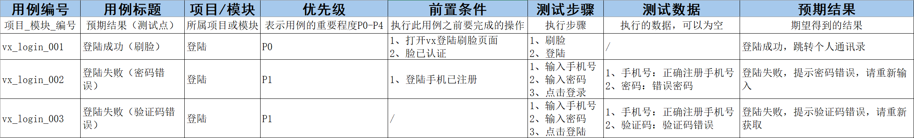

## 一、认识软件测试

### 1、什么是软件

控制计算机硬件工作的工具，展现的形态有很多种：聊天，音乐，视频，游戏，

### 2、 软件的组成

页面客户端————代码服务器————数据服务器

### 3、软件产生的过程

（需求方，产品经理）需求产生——（产品经理）需求文档——（UI设计师）设计效果图——（研发人员）产品开发——（测试人员）产品测试——部署上线

### 4、 什么是软件测试

使用技术手段验证软件是否满足需求的使用；

**e.g.**在登陆页面使用网络技术测试安全需求

### 5、软件测试的目的

减少软件bug，

**e.g.**从需求产生——需求输出——UI设计——产品开发，每一个环节都有可能存在缺陷

## 二、测试的主流技能

### 1、 功能测试

验证程序的功能是否满足需求 

### 2、 自动化测试

通过自动化工具代替手工，对项目进行测试

### 3、接口测试

使用代码或工具对服务端提供的接口进行测试

### 4、 性能测试

模拟多人使用软件，查找服务器缺陷

## 三、常见测试阶段划分

### **1、按测试阶段划**

单元测试：对程序源代码进行测试（交付给测试之前先自测）bug太多，修复率太低，必须要做

集成测试：又称为接口测试，针对模块之间访问地址进行测试

系统测试：对整个系统进行测试、包括功能、兼容、文档测试、需求说明书等全面测试（组装起来测）

验收测试：使用不同用户（内测版、公测版）进行测试

### **2、按代码可见度划分**

黑盒测试（源代码不可见，UI、功能可见）针对功能，又叫做系统测试

灰盒测试（部分源代码可见，功能不可见）针对部分代码进行测试，测接口，也就是集成测试

白盒测试（全部源代码可见）针对代码测试，也就是单元测试

## 四、质量模型

质量模型：功能、性能、兼容、易用、可靠、安全、可移植、可维护

**1、功能：** **01** 功能数量 **02** 正确实现 **03** 错误处理情况

**2、性能：** **01** 服务器每秒请求数 **02** 服务器硬件配置是否满足

**3、兼容：** **01** 浏览器（Google、IE、FireFox、Opera、Edge、safari）**02** 操作系统（win7 win8 win10 win11 Mac Linux）**03** 手机（分辨率、品牌、系统、网络、软件、硬件）

**4、易用： 01** 简洁 **02** 友好 03 流程 **04** 美观

**5、可靠：** **01** 无响应 **02** 卡顿 03死机崩溃

**6、安全：** **01** 传输加密 02 加密存储

**7、可移植： ** **01** 网站数据迁移

**8、可维护：** **01** 容易维护

## 六、测试流程

需求评审、计划编写、用例设计、用例执行（测试过程）、缺陷管理（提交回归关闭）、测试报告

**1、需求评审：**确保各部门需求理解一致

**2、计划编写：**测什么、谁来测、怎么测

**3、用例设计：**验证项目是否符合需求的操作文档

**4、用例执行：**项目模块开发完成后开始执行用例文档实施测试

**5、缺陷管理：**提交bug给开发，修复后回归测试，测试通过就关闭

**6、测试报告：**实施测试结果文档

## 七、测试用例

**1、什么是用例：**用户使用的案例Log in

**2、什么是测试用例：**是为测试项目而设计的执行文档

**3、测试用例的作用：**防止漏测，实施测试的标准

**4、用例格式的编写：**八大要素：**01**用例编号 **02** 用力标题 **03** 项目/模块 **04** 优先级 **05** 前置条件 **06** 测试步骤 **07** 测试数据 **08** 预期结果

 在视图页面设置首行冻结，首行背景蓝色

**5、 QQ用例练习：**

需求：**01** 账号为空	**02**账号未注册	**03**密码未空	**04**密码错误

