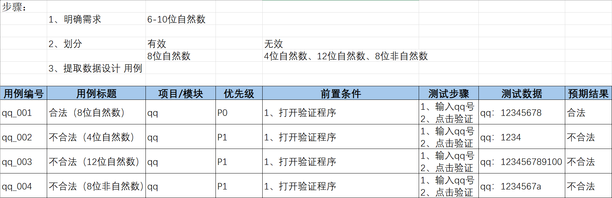

## 等价划分法（针对穷举场景设计测试点）

### 1、**说明：**在所有测试数据中，具有某种共同特征的数据集合进行划分；

### **2、分类：**有效等价类、无效等价类

**有效等价类：**满足需求的数据集合；

**无效等价类：**不满足需求的数据集合；**只取其中之一**；

### **3、步骤：**

**01 明确需求**

**02 确定有效或无效等价类**

**03 提取数据编写测试用例**

### 4、案例

#### **e.g.1** 验证qq账号的合法性    要求：6-10位自然数

#### **e.g.2**验证某城市电话号码正确性  需求：1、区号：空或者是三位数字	2、前缀码：非0且非1开头的三位数字	3、后缀码：四位数字

