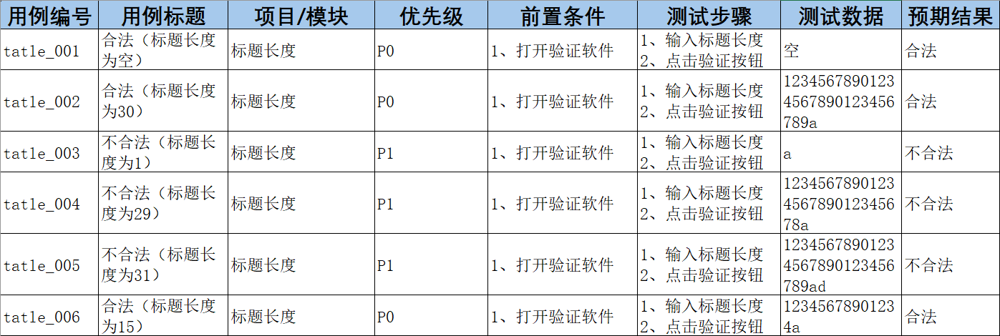
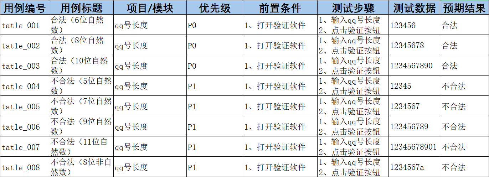
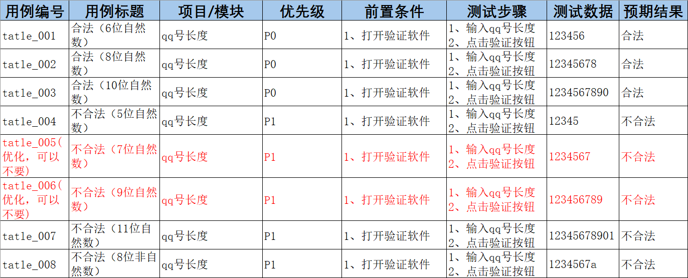

## 边界值分析法（针对限定边界规划设计测试点）

### **1、边界范围节点：**正好等于、刚好大于、刚好小于边界的值作为测试数据

**01上点：**边界上的点（正好等于）

**02离点：**距离上点最近的点（刚好大于，刚好小于）

**03内点：**范围内的点（区间范围内的数据）

一定是7条用例

### **2、应用设计步骤：**

**01** 明确需求

**02** 确定有效和无效等价类

**03** 确定边界范围值

**04** 提取数据编写测试用例

**P.S.** 长度，类型，规则，在边界值分析法种，有效与无效等价类只做类型校验，长度交给边界值

### 3、**案例：**

#### **e.g.1**需求，通过边界值法验证标题长度的合法性

要求：标题长度大于0，小于等于30个字符

**01 明确需求：**
标题长度大于0，小于等于30个字符

**02 划分有效等价无效等价（关注类型）：**

此题不考虑，全是字符

**03 划分边界：**

上点：0，30

离点：1，29，31（不考虑-1，没实际用处）

内点：15

**04 提取数据，设计用例：**

空(null)

12345678901234567890123456789a

a

12345678901234567890123456789

12345678901234567890123456789ad

12345678901234a 

  

#### **e.g.2:**需求：通过边界值法验证qq号码的合法性     要求：6-10位自然数

**01 明确需求**

qq号长度为6-10位自然数

**02 划分等价（类型）**

有效：自然数；无效：非自然数

**03 划分边界**

上点：6，10

离点：5，7，9，11

内点：8

**04 提取数据，设计用例**

正向：123456	12345678	1234567890

逆向：12345	1234567	123456789	12345678901	1234567a

### 4、优化：

7个优化成5个

上点必选，内点必选，离点考虑开必区间，开区间选择内部离点，闭区间选择外部离点**（开内闭外）**

为什么内点必测？验证范围的连续性

### 5、**使用场景：**

在等价类的基础上针对有边界范围的测试数据输入的地方（重点关注边界）

常见的描述词有大小、尺寸、重量、最大、最小、至多、至少等

典型代表有：有边界范围的输入框类测试