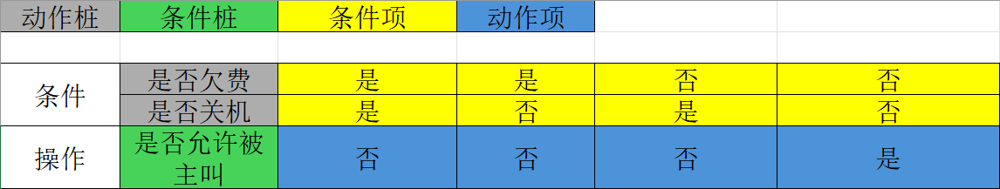
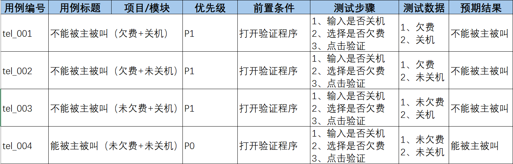
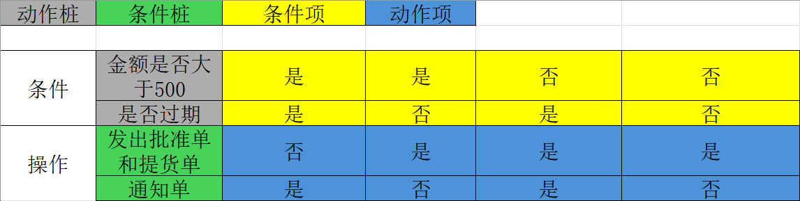
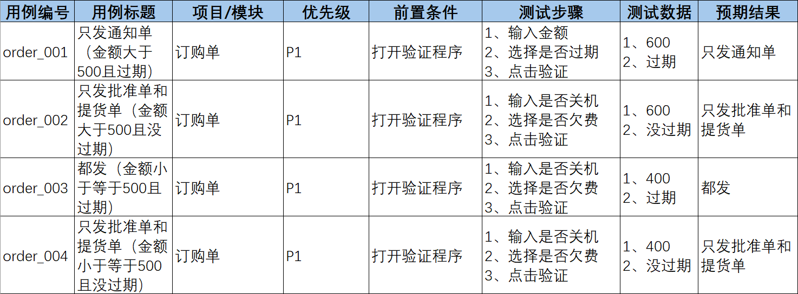
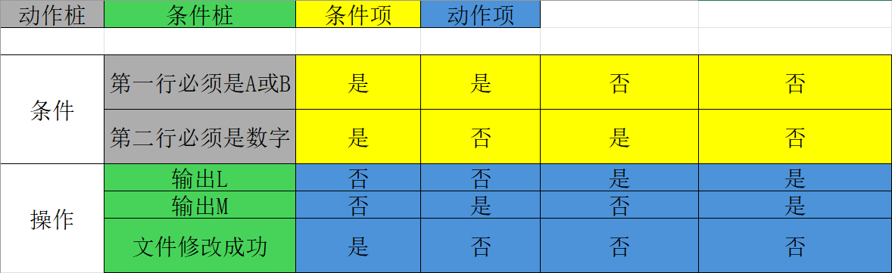
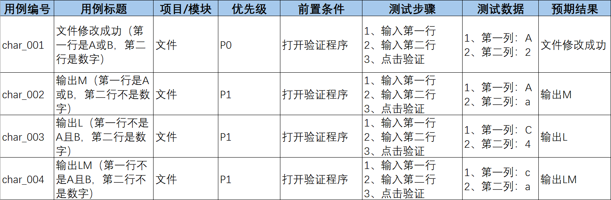

## 判定表法（针对多条件依赖关系设计测试点）

### 1、说明：对条件进行组合测试

### 2、定义：是一种以表格形式表达多条件逻辑判断的工具

### 3、组成

**01 条件桩：**列出问题中的所有条件，列出条件的次序无关紧要。

**02 动作桩：**列出问题中可能采取的操作，操作的排列顺序没用约束。

**03 条件项：**列出条件对应的取值，所有可能情况下的真假值。

**04 动作项：**列出条件项的，各种取值情况下应该采取的动作结果。

### 4、案例：e.g.1验证“若用户欠费或者关机，则不允许主被叫”功能的测试

### e.g.2: 金额与通知单

**01 明确需求：**

（1）如果金额大于500元，又未过期，则发出批准单和提货单；
（2）如果金额大于500元，但过期了，则不发批准单与提货单；
（3）如果金额小于等于500元，则不论是否过期都发出批准单和提货单；
（4）在过期的情况下不论金额大小还需要发出通知单。

**02 画判定表**

**03 提取数据设计用例：**

### e.g.3

**01 明确需求：**

（1）输入的第一列字符必须是A或B
（2）第二列字符必须是一个数字
（3）如果第一列字符不正确，则输出L
（4）如果第二列字符不正确，则输出M
（5）如果两列字符输入正确，则修改文件成功

**02 编写判定表：**

**03 提取数据设计用例：**

### 5、使用场景

有多个输入条件，多个输出结果，输入条件之间有组合关系，输入条件和输出结果之间有依赖关系

判定表一般适用于条件组合数量较少的情况（4个以下）计算方式是2n