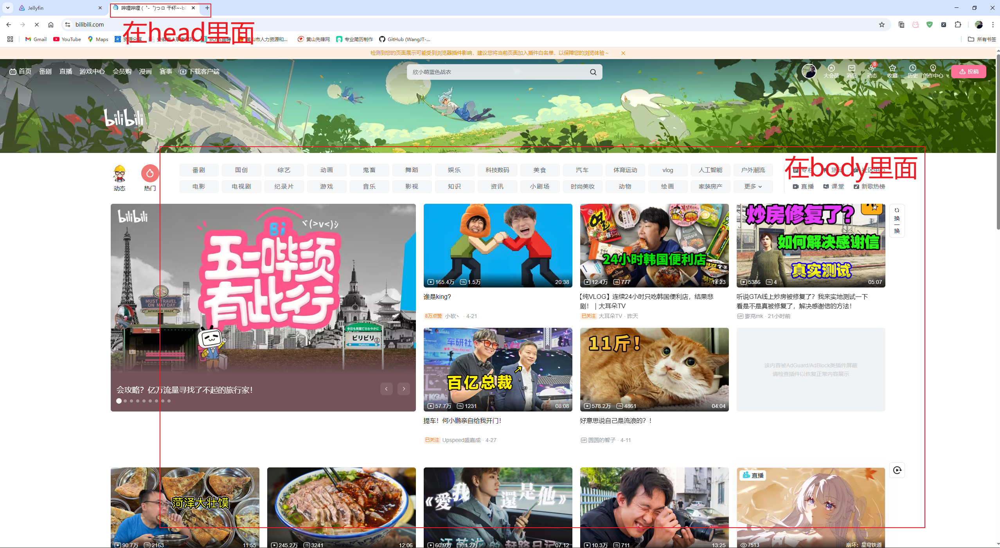

## HTML基础

### 1、HTML介绍

#### Web前端三大核心技术

- Html：负责网页的架构，用来描述网页的一种语言

  ```html
  单标签<br />
  双标签<b>内容</b>
  属性：属性名=“属性值”
  <a href="http://www.jd.com">京东</a>
  ```

- CSS：负责网页的样式、美化

- JS：负责王网页的行为，控制css和html显示页面的内容

### 3、骨架标签

```html
<!DOCTYPE html>
<html>
    <head>
        <meta charset="UTF-8">
        <title>测试学习HTML基础</title>
    </head>
    <body>
        测试学习HTML基础
    </body>
</html>
        
```



### 3、编写HTML工具

#### HBuilder


