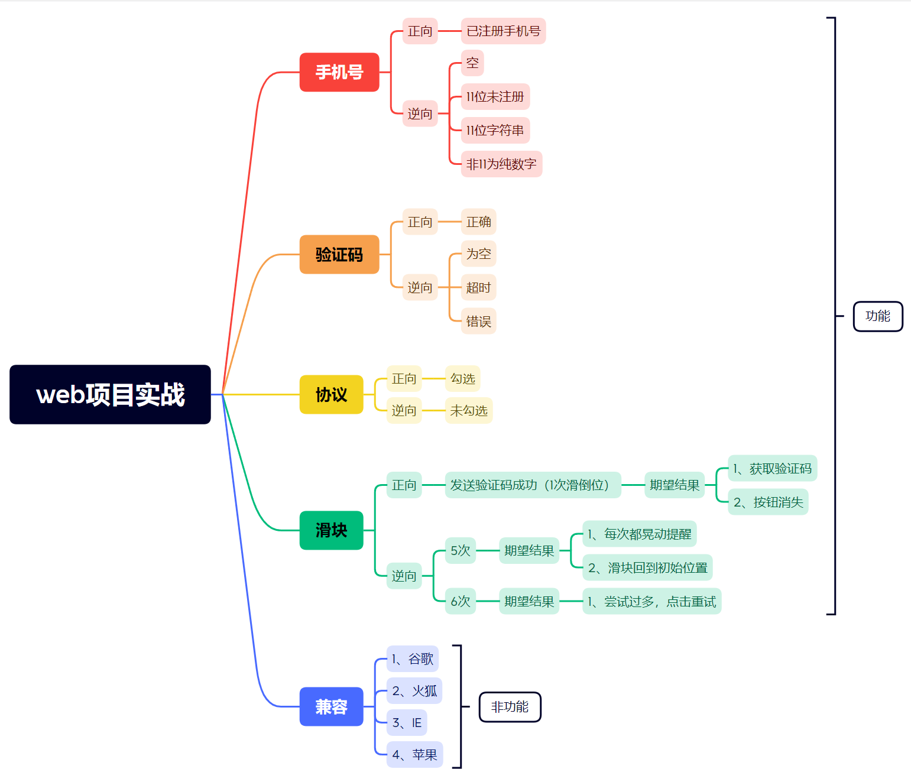
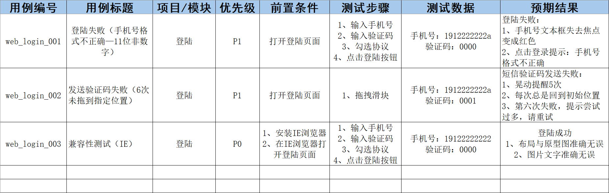

## 项目功能测试

### 1、测试对象

- **完成黑马头条web登陆功能测试**
- **完成黑马头条web发布功能测试**

### 2、登陆需求

#### （1）请输入正确的中国手机号（11位）：

- 当文本框失去焦点的时候验证，红色为失效，绿色为成功

#### （2）点击发送验证码：

- 如果手机号文本框状态为绿色，弹出“点击按钮进行验证”；如果手机号文本框为红色，提示手机号不正确

#### （3）点击验证按钮进行验证

- 拖拽图形到指定位置，按钮消失；拖拽图形未到指定位置，晃动提醒，滑块回到初始位置；超过5次，提示尝试过多，请点击重试；

#### （4）输入验证码

- 正确的验证码，并“勾选我已阅读并同意”，点击登录，进入系统；
- 错误的验证码，并“勾选我已阅读并同意”，点击登录，提示验证码错误；
- 正确的验证码，未“勾选我已阅读并同意”，点击登录，提示请勾选；

#### （5）点击登陆

- 手机号、验证码都为绿色，勾选“我已阅读并同意”，登录成功

### 3、登陆测试点设计

### 4、登陆用例设计

### 5、发布需求

- 文章标题不能小于5个字符

- 文章内容不能为空

- 频道不能为空，

- 封面选择：单图、三图、无图、自动

- 点击选择图片：

  - 素材库、上传图片切换

  - 素材库：全部和收藏切换、图片可以选择
    上传图片：（1）点击选择图片-选择本地文件（2）点击开始上传-如果已经选择本地文件，点击上传，上传成功（3）点击开始上传-如果未选择本地文件，提示"请选择一张图片"

- 点击发表，提示新增文章成功，跳转到内容列表，文章状态显示待审核
- 点击存入草稿，提示新增文章成功，跳转到内容列表，文章状态显示草稿